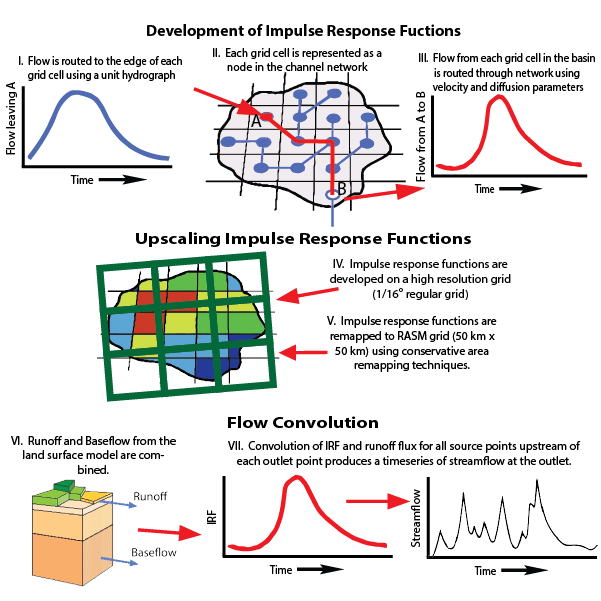

# RVIC Model Overview

The RVIC model is a modified version of the streamflow routing model typically used as a post-processor with the Variable Infiltration Capacity (VIC) hydrology model.  The routing model is a source-to-sink model that solves a linearized version of the Saint-Venant equations.  This model, developed by Lohmann et al. (1996), has been used in many offline studies at a variety of spatial scales.  Key points of the RVIC routing model are:

1. Utilizes Impulse Response Functions (i.e. Unit-Hydrographs) to represent distribution of flow at the outlet point with respect to time from an impulse input at each source point.
1. Impulse Response Functions (IRFs) are linear and time invariant.
1. Flow velocity and diffusion parameters may be calibrated.
1. Development of the IRFs may be done on a high-resolution standard latitude-longitude grid.  This avoids the requirement of developing flow direction inputs on individual model grids.
1. High-resolution impulse response functions are upscaled to the land grid using a conservative area remapping technique.  This approach maintains the fine-scale response features present in the high-resolution flow networks.
1. Development of IRFs is done as a pre-process so that the only step to be completed in the coupled model is the flow convolution, significantly reducing computation time.


*Figure: RVIC Model Schematic.*

## Development of Impulse Response Functions
The routing model represents the source-to-sink response of flow from any model grid cell to a downstream point as a linear and time invariant response to an impulse of runoff.  Therefore, the development of the impulse response function between any source and sink points is only a function of the horizontal travel time of water within the source grid cell and to the downstream point with the addition of a flow diffusion parameter.  The Saint-Venant equation

```∂Q/∂t=D (∂^2 Q)/∂x+C ∂Q/∂x,                         (1)```

represents the flow at a downstream point as a function of the wave velocity, C, and the diffusivity, D; both of which may be estimated from geographical data.  Eq. (1) can be solved with convolution integrals

```Q(x,t)=∫_0^t▒〖U(t-s)h(x,s)ds〗,                      (2) ```

where

```h(x,t)=  x/(2t√πtD) exp⁡(-〖(Ct-x)〗^2/4Dt)                       (3)```

is Green’s impulse response function.  The Saint-Venant equations are solved for the flow response from every upstream grid cell to a common downstream location.

## Upscaling Impulse Response Functions
The development of the impulse response functions can be done on a high resolution flow network.  Whereas the typical employment of the VIC routing model immediately convolves the fluxes from every grid cell, the implementation here first upscales and aggregates the high resolution IRF grid to the land model grid. The upscaling process uses the first-order conservative remapping technique developed by Jones (1999). Because the re¬mapping scheme is conservative, the unit response to runoff (unit hydrograph) from each land model grid cell is maintained. The routing and regridding process is repeated for every streamflow location of interest in the model domain, such as basin outlets and stream gauging sites.  Finally, the regridded IRFs may be aggregated to include all basins flowing into a single land model grid cell.

## Flow Convolution
With the development of the IRFs complete, the convolution simply aggregates the flow contribution from all upstream grid cells at every timestep lagged according the IRF.  Understanding that only some fraction of the flow from each grid cell reaches a downstream point at each timestep, the RVIC convolution scheme adds additional runoff reaching the ocean for future timesteps as the model progresses.
